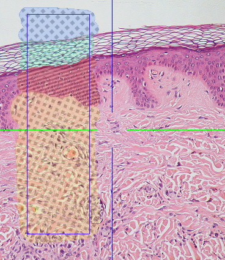
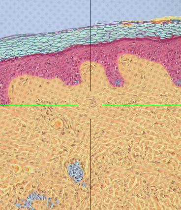

# Learned Segmenter

This example trains a segmenter from a volume annotation and applies it to the whole dataset.

<figure markdown>
  
  <figcaption>Volume annotation used for training</figcaption>
</figure>
<figure markdown>
  
  <figcaption>Result of the trained segmenter on the full dataset</figcaption>
</figure>

It builds upon the two previous examples using the [Dataset API](dataset_usage.md) and [dataset upload](upload_image_data.md).
Additionally, it downloads [this manual volume annotation of a subset of the skin example dataset](https://webknossos.org/annotations/Explorational/616457c2010000870032ced4) which is used for training.

*This example additionally needs the scikit-learn and pooch packages.*

```python
--8<--
webknossos/examples/learned_segmenter.py
--8<--
```

This example is inspired by [the trainable segmentation example from scikit-image](https://scikit-image.org/docs/dev/auto_examples/segmentation/plot_trainable_segmentation.html).
