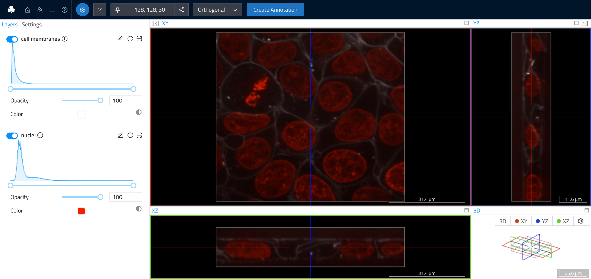

# Upload Image Data

Loads the [cell dataset](https://scikit-image.org/docs/dev/api/skimage.data.html#skimage.data.cell), writes it into a [wkw Dataset](../../api/webknossos/dataset/dataset.md) and uploads it to a local webknossos instance using [`webknossos_context`](../../api/webknossos/client/context.md#webknossos.client.context.webknossos_context).

```python
--8<--
webknossos/examples/upload_image_data.py
--8<--
```


