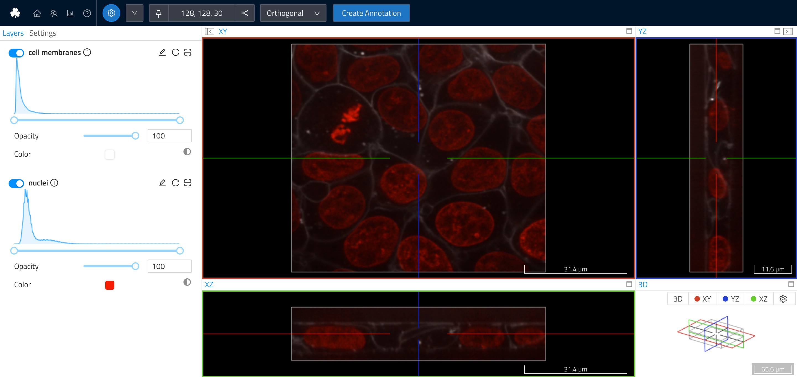

# Intro

The `webknossos` Python package provides an API for working with [WEBKNOSSOS](https://webknossos.org) datasets,
annotations, and for WEBKNOSSOS server interaction.
To get started, check out the [installation instructions](installation.md) and the code examples, such as

* [Intro to Dataset Usage](examples/dataset_usage.md)
* [How to Upload a Dataset](examples/upload_image_data.md) 
  {: style="max-width: calc(100%/2 - 1em);"}
* [How to Download a Dataset](examples/download_image_data.md)
* [Using a Volume Annotation to Train a Custom Segmenter](examples/learned_segmenter.md) 
  {: style="max-width: calc(100%/4 - 1em);"}
  {: style="max-width: calc(100%/4 - 1em);"}

## Features

- Easy-to-use dataset API for reading/writing/editing raw 2D/3D image data
  and volume annotations/segmentation in WEBKNOSSOS wrap (*.wkw) format
    - Add/remove layers
    - Update metadata (`datasource-properties.json`)
    - Up/downsample layers
    - Compress layers
    - Add/remove magnifications
    - Execute any of the `webknossos` CLI operations from your code
- Manipulation of WEBKNOSSOS skeleton annotations (*.nml) as Python objects
    - Access to nodes, comments, trees, bounding boxes, metadata, etc.
    - Create new skeleton annotation from Graph structures or Python objects
- Interaction, connection & scripting with your WEBKNOSSOS instance over the REST API
    - Up- & downloading annotations and datasets
    - Read datasets from the WEBKNOSSOS server in a streaming fashion 

## Source Code

The `webknossos` Python package is [open-source on GitHub](https://github.com/scalableminds/webknossos-libs). Feel free to report bugs there or open pull requests with your features and fixes.

## License
[AGPLv3](https://www.gnu.org/licenses/agpl-3.0.html)
Copyright [scalable minds](https://scalableminds.com)
